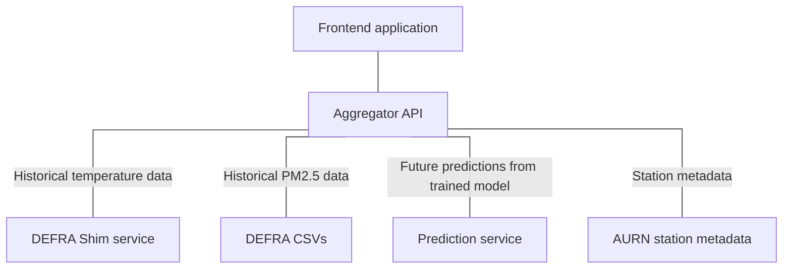

# COMP3000 Project - Frontend
#### Project title: EDDAP (Environmental Data Display and Predictions)
#### Supervisor: Dr David Walker

## What is this?

This repository contains a React application that presents air quality and temperature data on a map, retrieving data from the aggregator API. This allows users to 
gain an understanding of the climate emergency, how it has developed over time and the potential trajectory of the future. 

## Navigation

- Frontend (you are here)
- [Aggregator](https://github.com/Lewis-Trowbridge/COMP3000-Project-Backend-API)
- [Predictions](https://github.com/Lewis-Trowbridge/COMP3000-Project-Machine-Learning)
- [Metadata](https://github.com/Lewis-Trowbridge/COMP3000-DEFRA-To-Mongo)
- [Shim](https://github.com/Lewis-Trowbridge/COMP3000-Project-DEFRA-Shim)

## How is it made?

This service uses Node 16 and React to produce a static website, making requests to APIs to dynamically render data. Some key points about the implementation are:

- Service uses React Leaflet and OpenStreetMap to provide the map UI
- Service uses functional components and hooks to manage UI in a smooth, non-blocking manner
- Functional tests are performed using Cypress and Browserstack, ensuring cross-browser compatibility

## How do I use it?

The code requires Node 16. Commands are as in the package.json -

- `npm run` - Builds and starts the development server
- `npm build` - Builds the production build to /dist
- `npm test` - Runs unit tests

## Project vision

- For: researchers and the public
- Who: need a better understanding of the climate crisis
- The: environmental data dashboard
- Is a: web application dashboard
- That: can make predictions for the future of the environment and display environmental data such as air pollution in an easy-to-understand format

